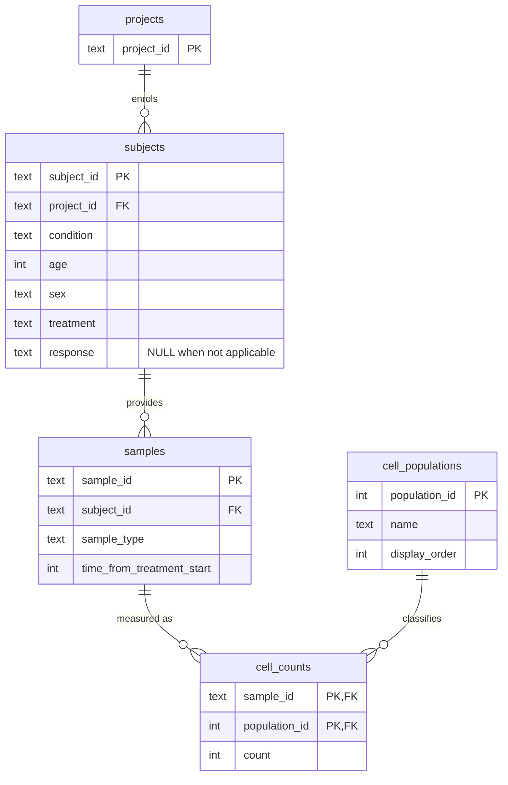

# Immune cell population analysis - Loblaw Bio clinical trial

A Python + SQLite pipeline and an interactive dashboard for understanding how a drug
candidate (**miraclib**) affects immune cell populations, built around the four questions in the brief:

| Part | Question | Where |
|---|---|---|
| 1 | Model the data relationally and load `cell-count.csv` | `load_data.py`, `cellcount/schema.sql` |
| 2 | Relative frequency of each cell population in each sample | `cellcount/summary.py` -> `outputs/part2_summary_table.csv` |
| 3 | Do melanoma patients on miraclib who respond differ from non-responders? (PBMC only) | `cellcount/stats.py` -> `outputs/part3_*` |
| 4 | Baseline (day 0) melanoma PBMC samples from miraclib patients; the B-cell question | `cellcount/subsets.py` -> `outputs/part4_*` |

**Dashboard:** https://REPLACE-WITH-YOUR-APP.streamlit.app (hosted on Streamlit Community Cloud; see
[Dashboard](#dashboard)). It also runs locally with `make dashboard`.

---

## Quick start

Works in GitHub Codespaces or on any machine with Python >= 3.9 and `make`.

```bash
make setup      # install dependencies from requirements.txt
make pipeline   # python load_data.py  ->  cell_counts.db ; python run_analysis.py  ->  outputs/
make dashboard  # serve the interactive dashboard on http://localhost:8501
make test       # pytest: loader, schema views and every analysis function cross-checked against pandas
```

* In **Codespaces**, `.devcontainer/devcontainer.json` selects a Python 3.11 image, runs `make setup`
  automatically and forwards port 8501. After `make dashboard`, open the forwarded port from the
  *Ports* tab (or the pop-up notification).
* `make pipeline` needs no arguments and no manual intervention; it rebuilds the database from scratch
  every time, so it is idempotent. It takes a few seconds.
* The input (`cell-count.csv`), the database (`cell_counts.db`) and every generated file (`outputs/`)
  are committed, so results can be inspected without running anything. `outputs/REPORT.md` is a
  human-readable summary of all results, `outputs/results.json` a machine-readable one.

## Results at a glance

**Part 2** - `outputs/part2_summary_table.csv`: 52,500 rows = 10,500 samples x 5 populations, with columns
`sample, total_count, population, count, percentage` (`total_count` = sum of the five counts of the sample,
`percentage = 100 * count / total_count`).

**Part 3** - melanoma / miraclib / PBMC: 993 responder samples (331 subjects) vs 975 non-responder samples
(325 subjects). Two-sided Mann-Whitney U on the per-sample percentages, Benjamini-Hochberg (BH) corrected
across the five populations; Cliff's delta > 0 means higher in responders:

| population | median resp. | median non-resp. | Cliff's delta | MWU p | MWU q (BH) | Welch p | Welch q (BH) |
|---|---|---|---|---|---|---|---|
| b_cell     |  9.43 |  9.79 | -0.050 | 0.056 | 0.139 | 0.171 | 0.321 |
| cd8_t_cell | 24.73 | 24.60 | -0.012 | 0.639 | 0.639 | 0.768 | 0.768 |
| cd4_t_cell | 30.22 | 29.66 | **+0.064** | **0.013** | 0.067 | **0.005** | **0.025** |
| nk_cell    | 14.51 | 14.80 | -0.040 | 0.121 | 0.202 | 0.193 | 0.321 |
| monocyte   | 19.61 | 19.94 | -0.036 | 0.163 | 0.204 | 0.466 | 0.582 |

* **No population is significantly different after multiple-testing correction with the primary
  (Mann-Whitney) test** at q < 0.05.
* **CD4 T cells are the one candidate**: relative frequency is higher in responders (median 30.2 % vs
  29.7 %), nominally significant (p = 0.013; Welch's t-test p = 0.005, which *does* survive BH correction,
  q = 0.025), but the effect is small (Cliff's delta = +0.064, i.e. a random responder exceeds a random
  non-responder only ~53 % of the time).
* The signal is robust to how the repeated measures are handled: averaging each subject's three samples
  first gives the same result (cd4_t_cell p = 0.012, q = 0.062, delta = +0.11), and testing each day
  separately shows no difference at baseline (day 0, p = 0.80) but a growing one on treatment (day 7
  p = 0.030, day 14 p = 0.076) - consistent with a treatment-related shift rather than a pre-treatment
  predictor. B cells trend lower in responders at day 14 (p = 0.014, q = 0.072).
* Conclusion for the colleague: CD4 T-cell frequency is a plausible but weak correlate of miraclib
  response that needs confirmation in an independent cohort before it is used to predict response; no
  other population shows evidence of a difference. Boxplots: `outputs/part3_boxplots.png` (one file per
  population is also written).

**Part 4** - melanoma, miraclib, PBMC, `time_from_treatment_start = 0`: **656 samples from 656 subjects**.

| samples per project | | subjects by response | | subjects by sex | |
|---|---|---|---|---|---|
| prj1 | 384 | responders | 331 | male | 344 |
| prj2 | 0 | non-responders | 325 | female | 312 |
| prj3 | 272 | | | | |

(prj2 contains only whole-blood samples, so it contributes no PBMC samples; it is listed to make that explicit.)

**Average B-cell count for melanoma males who responded, at time 0, across all sample and treatment
types: `10206.15`** (mean of the raw `b_cell` count over 485 samples; `outputs/part4_avg_b_cells_melanoma_male_responders_baseline.txt`).

## Database schema

`load_data.py` creates `cell_counts.db` from `cellcount/schema.sql`:



| Table | One row per | Notes |
|---|---|---|
| `projects` | project | `prj1`, `prj2`, `prj3` |
| `subjects` | patient / donor | condition, age, sex, treatment and response are constant per subject in the data, so they are stored once (the loader verifies this and refuses conflicting rows). `response` is `NULL` for healthy, untreated subjects instead of an empty string. |
| `samples` | biological sample | sample type (PBMC / WB) and time point. `UNIQUE (subject_id, sample_type, time_from_treatment_start)` prevents accidental double loading. |
| `cell_populations` | immune population | lookup table with a display order; new populations are rows, not columns. |
| `cell_counts` | (sample, population) | **long format**: `count` for one population in one sample. PK `(sample_id, population_id)`. |

Three views give every consumer the same definitions:

* `sample_totals` - total cells per sample (sum over populations);
* `sample_frequencies` - the Part 2 table (`sample, total_count, population, count, percentage`);
* `sample_metadata` - one row per sample with its subject and project attributes denormalised for filtering.

Indexes cover the join and filter columns (`subjects(project_id)`, `subjects(condition, treatment, response)`,
`samples(subject_id)`, `samples(sample_type, time_from_treatment_start)`, `cell_counts(population_id)`);
foreign keys are enforced (`PRAGMA foreign_keys = ON`) and CHECK constraints guard the categorical columns
and non-negative counts.

### Why this design

* **Third normal form, no repeated facts.** In the CSV every subject's demographics are copied onto each of
  their three samples. Storing them once removes the possibility of a subject having two ages or two
  responses, and makes subject-level questions (Part 4: "how many *subjects* were male") a plain
  `COUNT(DISTINCT subject_id)` rather than a de-duplication exercise.
* **Long-format counts instead of one column per population.** A wide table (`b_cell, cd8_t_cell, ...`)
  needs an `ALTER TABLE` and code changes whenever a new marker or gating panel is introduced. With
  `cell_counts`, relative frequencies, totals, per-population statistics and "which populations exist"
  are all `GROUP BY population`; the analysis code never hard-codes column names, and panels with
  different population sets can coexist.
* **Definitions live in the database.** The percentage in Part 2 is computed by the `sample_frequencies`
  view, so the pipeline, the dashboard, the tests and any ad-hoc SQL agree by construction.
* **Validation at load time.** Consistency checks and constraints turn silent data problems into loud
  load failures.

### How it scales (hundreds of projects, thousands of samples, many analyses)

* **Volume.** The schema grows linearly: `samples x populations` count rows. Thousands of samples and a few
  dozen populations is on the order of 10^5-10^6 rows, which SQLite handles comfortably with the indexes
  above; the current 52,500-row database answers every query in this project in milliseconds.
* **Same DDL on a server database.** The schema is standard SQL, so it moves to PostgreSQL unchanged when
  concurrent writers, multiple analysts or a hosted dashboard need it. There, `sample_frequencies` becomes
  a materialised view (or a table refreshed by the loader) and `cell_counts` can be partitioned by project.
* **Richer study designs need new tables, not new columns.** If subjects can be enrolled in several
  projects or treatment arms, `project_id`, `treatment` and `response` move to an `enrollments`
  (subject x project) table; irregular visit schedules get a `visits` table; different gating panels get a
  `panels` table that `cell_populations` references; batches/instruments attach to `samples`. None of these
  changes touch the count table or the frequency view.
* **Many analytics.** Persisting pipeline results in `analysis_results` tables keyed by
  (run id, cohort definition, population) gives provenance and lets the dashboard read precomputed statistics
  for heavy analyses while still computing light ones live. New question types (longitudinal models, other
  outcomes) are new SQL views or library functions over the same normalised core.
* **Operations.** The loader is a deterministic rebuild today; at scale it becomes an incremental upsert
  keyed on the natural ids (`sample_id`, `subject_id`) with the same validation, and schema changes are
  managed with migrations (e.g. Alembic).

## Code structure

```
.
├── Makefile                  setup / pipeline / dashboard / test / clean targets
├── requirements.txt
├── cell-count.csv            input data
├── load_data.py              Part 1: builds cell_counts.db (standard library only; no arguments)
├── run_analysis.py           Parts 2-4: runs the analysis and writes outputs/ (tables, figures, REPORT.md, results.json)
├── cellcount/                reusable analysis library
│   ├── schema.sql            DDL, indexes and views (the single definition of the data model)
│   ├── db.py                 paths, connection helper, parameterised query() -> DataFrame
│   ├── summary.py            Part 2: per-sample relative frequencies (reads the sample_frequencies view)
│   ├── stats.py              Part 3: cohort query, Mann-Whitney / Welch tests, Cliff's delta, BH correction, boxplots
│   └── subsets.py            Part 4: baseline cohort queries, per-project / response / sex counts, average counts
├── dashboard/app.py          Streamlit dashboard (Parts 2-4, computed live from the database)
├── tests/test_pipeline.py    pytest suite (9 tests) - every SQL result is recomputed with pandas from the CSV
├── outputs/                  generated by `make pipeline`
├── cell_counts.db            generated by `python load_data.py`
├── .devcontainer/            Codespaces configuration (Python 3.11, auto `make setup`, port 8501)
└── .streamlit/config.toml    headless server settings
```

Design choices:

* **Thin entry points, one library.** `load_data.py`, `run_analysis.py` and `dashboard/app.py` are small
  scripts that call functions in `cellcount/`. The dashboard therefore shows exactly the numbers the
  pipeline wrote, because both run the same code against the same database; the tests exercise the same
  functions again.
* **SQL where SQL is best, pandas where it is not.** Filtering, joining and counting (Parts 2 and 4) are
  parameterised SQL against the views; statistics and plotting (Part 3) use pandas, SciPy and matplotlib /
  Plotly. Every query takes its filters as parameters, so the dashboard can re-run the Part 3 comparison
  for other cohorts (e.g. carcinoma / phauximab / whole blood) and the Part 4 counts for any subset.
* **`load_data.py` depends only on the standard library**, so the database can be built before any
  package is installed, and the schema is a readable `.sql` file rather than ORM classes.
* **Reproducible, inspectable outputs.** The pipeline rebuilds everything from the CSV and writes plain CSV /
  PNG / Markdown / JSON files that are committed to the repository.

## Analysis methods (Part 3)

1. Cohort: `condition = 'melanoma' AND treatment = 'miraclib' AND sample_type = 'PBMC'` with a recorded
   response, joined to the Part 2 frequencies (`outputs/part3_responder_dataset.csv`).
2. For each population, responders vs non-responders on the per-sample relative frequency:
   two-sided **Mann-Whitney U** (primary; makes no normality assumption), **Welch's t-test** (companion),
   **Cliff's delta** (effect size derived from U), and **Benjamini-Hochberg** adjustment of the p-values across
   the five populations. A population is reported as significant when the adjusted Mann-Whitney p < 0.05.
3. Because each subject contributes three samples (days 0, 7, 14), the sample-level test treats repeated
   measures as independent. Two sensitivity analyses are therefore reported as well: one value per subject
   (mean of its samples; `part3_stats_subject_level.csv`) and each time point separately
   (`part3_stats_by_timepoint.csv`).
4. Boxplots with jittered points for every population, annotated with p, q and delta (`part3_boxplots.png`,
   `part3_boxplot_<population>.png`).

## Dashboard

`make dashboard` starts a Streamlit app that reads `cell_counts.db` (and builds it first if it is missing,
so a fresh clone or a cloud deployment works without extra steps):

* **Part 2** - the full summary table with filters (project, condition, treatment, sample type, time point,
  population, free-text sample/subject search), CSV download, mean composition by condition and the
  distribution of each population.
* **Part 3** - choose the cohort (defaults: melanoma / miraclib / PBMC), the unit of analysis
  (samples or subject means), the time points and the significance level; interactive Plotly boxplots per
  population with p / q / delta annotations, the full statistics table, a written conclusion and the
  per-time-point sensitivity analysis.
* **Part 4** - the baseline cohort counts (samples per project, subjects by response and by sex) with
  charts, the list of baseline samples, the B-cell answer, and an explorer to compute the average count of
  any population for any subset.

**Publishing the link.** The app is deployed on Streamlit Community Cloud
(https://share.streamlit.io -> *New app* -> this repository, branch `main`, main file `dashboard/app.py`).
Because the database and `requirements.txt` are in the repository, no further configuration is needed.

## Assumptions and notes

* Blank `response` values (healthy, untreated subjects) are stored as `NULL`, and `treatment = 'none'` is kept
  as an explicit value; subjects without a response are excluded from the responder analysis.
* The Part 4 B-cell question is interpreted literally: `condition = 'melanoma'`, `sex = 'M'`, `response = 'yes'`,
  `time_from_treatment_start = 0`, with **no** filter on sample type or treatment; the reported value is the
  mean of the raw `b_cell` counts over the matching samples, rounded to two decimals.
* Numbers in this README come from `outputs/REPORT.md`; re-running `make pipeline` reproduces them exactly
  (the pipeline is deterministic).
