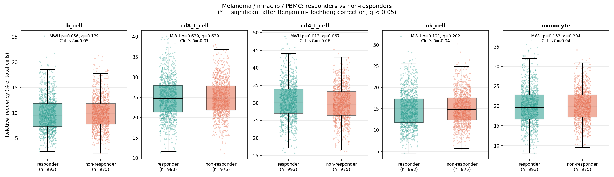

# Analysis report

Generated by `run_analysis.py` on 2026-09-09 00:13 UTC from `cell_counts.db`.

## Part 2 - Relative frequency of each cell population per sample

`part2_summary_table.csv` holds 52,500 rows: one per (sample, population) for
10,500 samples. `total_count` is the sum of the five population counts of the
sample and `percentage = 100 * count / total_count`. First rows:

| sample | total_count | population | count | percentage |
| --- | --- | --- | --- | --- |
| sample00000 | 93214 | b_cell | 10908 | 11.70 |
| sample00000 | 93214 | cd8_t_cell | 24440 | 26.22 |
| sample00000 | 93214 | cd4_t_cell | 20491 | 21.98 |
| sample00000 | 93214 | nk_cell | 13864 | 14.87 |
| sample00000 | 93214 | monocyte | 23511 | 25.22 |
| sample00001 | 100824 | b_cell | 6777 | 6.72 |
| sample00001 | 100824 | cd8_t_cell | 19407 | 19.25 |
| sample00001 | 100824 | cd4_t_cell | 33459 | 33.19 |
| sample00001 | 100824 | nk_cell | 18170 | 18.02 |
| sample00001 | 100824 | monocyte | 23011 | 22.82 |

## Part 3 - Responders vs non-responders (melanoma, miraclib, PBMC)

Cohort: condition = melanoma, treatment = miraclib, sample type = PBMC, response recorded.
993 responder samples from 331 subjects vs
975 non-responder samples from 325 subjects
(each subject contributes samples at days 0, 7 and 14).

Per-population tests on the per-sample relative frequencies (primary analysis). `mannwhitney_p_adj`
and `welch_p_adj` are Benjamini-Hochberg adjusted across the five populations; `significant` means
adjusted Mann-Whitney p < 0.05. Cliff's delta > 0 means responders tend to have higher values.

| population | n_responders | n_non_responders | median_responders | median_non_responders | cliffs_delta | mannwhitney_p | mannwhitney_p_adj | welch_p | welch_p_adj | significant |
| --- | --- | --- | --- | --- | --- | --- | --- | --- | --- | --- |
| b_cell | 993 | 975 | 9.432 | 9.788 | -0.050 | 0.056 | 0.139 | 0.171 | 0.321 | no |
| cd8_t_cell | 993 | 975 | 24.728 | 24.603 | -0.012 | 0.639 | 0.639 | 0.768 | 0.768 | no |
| cd4_t_cell | 993 | 975 | 30.221 | 29.658 | 0.064 | 0.013 | 0.067 | 0.005 | 0.025 | no |
| nk_cell | 993 | 975 | 14.509 | 14.799 | -0.040 | 0.121 | 0.202 | 0.193 | 0.321 | no |
| monocyte | 993 | 975 | 19.610 | 19.942 | -0.036 | 0.163 | 0.204 | 0.466 | 0.582 | no |

### Interpretation

No population differs significantly between responders and non-responders once the five tests are corrected for multiple comparisons (all Benjamini-Hochberg q >= 0.05).
Nominally significant before correction (uncorrected p < 0.05): cd4_t_cell (higher in responders; median 30.22% vs 29.66%, p = 0.013, q = 0.067, Cliff's delta = +0.064, Welch q = 0.025).
Averaging each subject's samples first (one value per subject, which removes the repeated-measures dependence) gives the same picture: nominal p < 0.05 for cd4_t_cell; significant after correction: none.
The strongest candidate predictor of miraclib response is **cd4_t_cell** (higher in responders), but the effect is small (Cliff's delta = +0.064, i.e. a 53% chance that a random responder exceeds a random non-responder) and should be confirmed in an independent cohort before being used to predict response.

### Sensitivity analysis 1 - one value per subject (mean of the subject's samples)

| population | n_responders | n_non_responders | median_responders | median_non_responders | cliffs_delta | mannwhitney_p | mannwhitney_p_adj | significant |
| --- | --- | --- | --- | --- | --- | --- | --- | --- |
| b_cell | 331 | 325 | 9.671 | 9.845 | -0.043 | 0.346 | 0.432 | no |
| cd8_t_cell | 331 | 325 | 24.897 | 25.010 | -0.022 | 0.622 | 0.622 | no |
| cd4_t_cell | 331 | 325 | 30.210 | 29.823 | 0.113 | 0.012 | 0.062 | no |
| nk_cell | 331 | 325 | 14.740 | 14.960 | -0.069 | 0.127 | 0.317 | no |
| monocyte | 331 | 325 | 19.795 | 20.277 | -0.050 | 0.264 | 0.432 | no |

### Sensitivity analysis 2 - each time point separately

| time_from_treatment_start | population | n_responders | n_non_responders | cliffs_delta | mannwhitney_p | mannwhitney_p_adj | significant |
| --- | --- | --- | --- | --- | --- | --- | --- |
| 0 | b_cell | 331 | 325 | 0.027 | 0.549 | 0.885 | no |
| 0 | cd8_t_cell | 331 | 325 | -0.029 | 0.514 | 0.885 | no |
| 0 | cd4_t_cell | 331 | 325 | 0.012 | 0.796 | 0.885 | no |
| 0 | nk_cell | 331 | 325 | -0.007 | 0.885 | 0.885 | no |
| 0 | monocyte | 331 | 325 | -0.056 | 0.211 | 0.885 | no |
| 7 | b_cell | 331 | 325 | -0.066 | 0.144 | 0.240 | no |
| 7 | cd8_t_cell | 331 | 325 | -0.021 | 0.638 | 0.638 | no |
| 7 | cd4_t_cell | 331 | 325 | 0.098 | 0.030 | 0.149 | no |
| 7 | nk_cell | 331 | 325 | -0.067 | 0.138 | 0.240 | no |
| 7 | monocyte | 331 | 325 | -0.032 | 0.484 | 0.605 | no |
| 14 | b_cell | 331 | 325 | -0.110 | 0.014 | 0.072 | no |
| 14 | cd8_t_cell | 331 | 325 | 0.015 | 0.741 | 0.741 | no |
| 14 | cd4_t_cell | 331 | 325 | 0.080 | 0.075 | 0.189 | no |
| 14 | nk_cell | 331 | 325 | -0.045 | 0.315 | 0.525 | no |
| 14 | monocyte | 331 | 325 | -0.021 | 0.647 | 0.741 | no |

## Part 4 - Baseline melanoma PBMC samples from miraclib-treated patients

Filters: {'condition': 'melanoma', 'treatment': 'miraclib', 'sample_type': 'PBMC', 'time_from_treatment_start': 0} -> **656 samples** from **656 subjects**
(`part4_baseline_samples.csv`).

Samples per project:

| project | n_samples |
| --- | --- |
| prj1 | 384 |
| prj2 | 0 |
| prj3 | 272 |

Subjects by response:

| response | n_subjects |
| --- | --- |
| responder | 331 |
| non-responder | 325 |

Subjects by sex:

| sex | n_subjects |
| --- | --- |
| female | 312 |
| male | 344 |

### Average B-cell count - melanoma males, responders, time 0 (all sample and treatment types)

**10206.15** cells (mean of the raw `b_cell` count over 485 samples).
